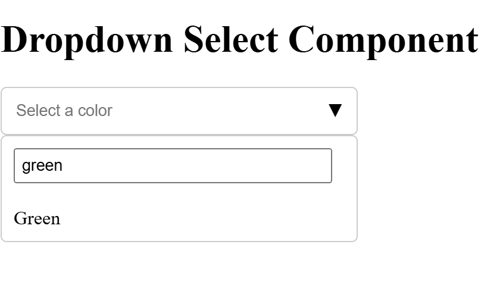
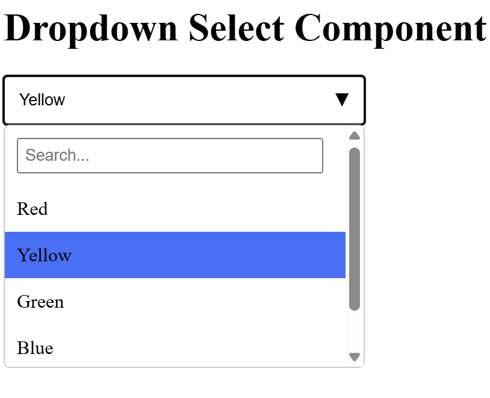

## Getting Started

First Install the npm package, npm install
(Makesure all the dependency in packag.json are added)

Please run first API(https://localhost:7000/api/DropdownData) to fetch colors data {Id,Name}
[Github link: https://github.com/hiren0071/WebAPIForColors.git] [Clone this repository and run API which is created in ASP.net Core API]
[You can use IDE Visual studio]

Now Run development server --> npm run dev

Implemented following Bonus functionality also, Please verify.
Keyboard navigation: Implement keyboard navigation to allow users to navigate through the dropdown menu using the arrow keys and select items using the enter key.

You can see the output below: (http://localhost:3000/)

